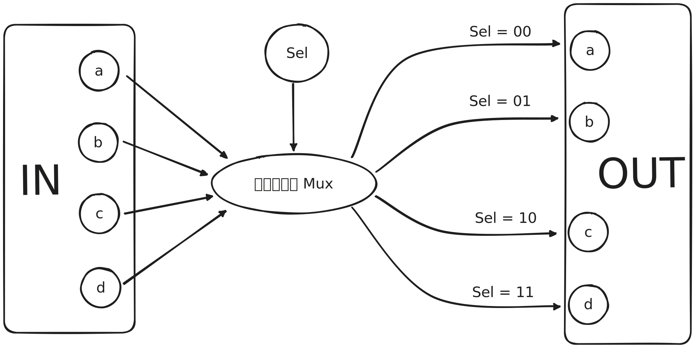

## 第一章：布尔逻辑

### 0.0 目的

构建并仿真 projects/01 目录里面的所有芯片

### 0.1 提示

* Nand 门是最原始的逻辑结构，所以我们不需要自己编写 Nand 门，而是使用 Nand 门去实现其他的逻辑关系。
* 所有 hdl 文件代码不在正文中展示，而在同目录下相应的 hdl 文件里。

### 一、And 逻辑的实现

#### 1.1 法一：先 Nand 再 Not

根据书本以及讲课的定义：

$$
a\  {\text{Nand}}\ b = \overline{a \times b} \\
\text{Not} \ (a) = \overline{a}\\
$$

因此我们可以推断出：

$$
a\ {\text{And}} \ b = a\times b =\overline{\overline{a \times b}}= \text{Not}(a \ \text{Nand} \ b)
$$

*注：这里可能会有问题，你必须先完成 Not 逻辑的实现，即你必须先完成 Not.hdl 文件的实现才能在 And.hdl 文件里调用 Not 逻辑，否则会加载不了芯片。

#### 1.2 法二：只使用 Nand 实现 And

首先对输入 a 和 b Nand 操作之后，我们再对 “a Nand b"的输出和布尔值 True 进行一个 Nand 逻辑

$$
a\ {\text{And}} \ b = (a \ \text{Nand} \ b)\ \text{Nand}\ (\text{True})
$$

如图：

对 x 和 y 各个情况进行讨论列出下表：

|   Key   | Value |  |  |  |
| :------: | :---: | :-: | :-: | :-: |
|    a    |   1   | 1 | 0 | 0 |
|    b    |   1   | 0 | 1 | 0 |
| a Nand b |   0   | 1 | 1 | 1 |
|   TRUE   |   1   | 1 | 1 | 1 |
|   out   |   1   | 0 | 0 | 0 |

### 二、Not 逻辑实现

这个就比较简单了，直接通过输入和 True 的 Nand 逻辑实现：

$$
\text{Not} \ (a) = a \  \text{Nand} \ \text{True} = \overline{a \times \text{True}}
$$

### 三、Or 逻辑实现

在书中就已经告诉了我们：

$$
a \ \text{Or} \ b = (a\ \text{Nand} \ a)\ \text{Nand}\ (b \  \text{Nand} \ b)
$$

因此我们先执行 $a\ \text{Nand} \ a$ 和 $b \  \text{Nand} \ b$，然后再对这两个的输出执行 Nand

### 四、Xor（异或） 逻辑实现

异或门的代码书中已经给出，此处不再赘述, 但仍旧给出原理公式：

$$
\text{Xor}(a,b) = \text{Or}(\text{And}(a,\text{Not}(b)), \text{And}(\text{Not}(a),b))
$$

### 五、Mux（Multiplexor）又叫“选择器” 逻辑实现

这个门的原理是根据输入变量 “Sel” 为 1 或者 0 分别选择输出为 a 或者 b。即如果 sel 是 0，那么输出 out = a，如果 Sel = 1，那么输出 out = b。

首先我们先实现输出等于输入，即 in = a, out = a：

$$
a = \text{Or}(a, 0)
$$

那么我们可以先搭个基本框架：

$$
\text{Mux} = \text{Or}(\text{Part1}(a,\ Sel), \ \text{Part2}(b,\ Sel))
$$

我们分情况讨论：

1. Sel = 0, 那么 $\text{Part1}(a,\ Sel)=\text{Part1}(a,\ 0)=a,\  \text{Part2}(b,\ Sel)=\text{Part2}(b,\ 0)=0$
2. Sel = 1, 那么 $\text{Part1}(a,\ Sel)=\text{Part1}(a,\ 1)=0,\  \text{Part2}(b,\ Sel)=\text{Part2}(b,\ 1)=b$

我们发现当 $\text{Part2}$ 是 $\text{And}$ , 而 $\text{Part2}$ 却没有可以匹配的，但我们可以转换 $Sel$ 的值为 $\text{Not}(Sel)$ ，我们可以得到我们的整个公式了：

$$
\text{Mux} = \text{Or}(\text{And}(a,\ \text{Not}(Sel)), \ \text{And}(b,\ Sel))
$$

### 六、DMux（Demultiplexor）逻辑实现

同理可得，分情况讨论

1. Sel = 0, 那么 $a=\text{Part1}(in,\ Sel)=\text{Part1}(in,\ 0)=in,\  b=\text{Part2}(in,\ Sel)=\text{Part2}(in,\ 0)=0$
2. Sel = 1, 那么 $a=\text{Part1}(in,\ Sel)=\text{Part1}(in,\ 1)=0,\  b=\text{Part2}(in,\ Sel)=\text{Part2}(in,\ 1)=in$

我们可以得到 $\text{Part2}$ 可以为 $\text{And}$ ，而在 $\text{Part1}$ 里，$Sel$ 的值要改为 $\text{Not}(Sel)$ ,因此我们应该是：

$$
a=\text{And}(in,\ \text{Not}(Sel))\\
b=\text{And}(in,\ Sel)
$$

### 七、多位 And \ Not \ Or \ Mux 逻辑实现

多位的操作是建立在单位的操作上，其实就是有几位就跑几次单位的循环，各个位数相互独立，所以只是单纯的重复即可，话说在 VS Code 里有了 Copliot 会自动告诉我们怎么写，以 And 为例，如图：

多位 Not；多位 Or 和多位 Mux 当然可以同理可得，不过 Mux 的输入里 $Sel$ 仍然是一位，所以不需要写成 $Sel[i]$。

### 八、多通道 Or 逻辑实现

对一个 n 位的 Or 门， 输入 n 位变量，输出一位的 out。当 n 位输入变量任意一位或以上为 1，则输出为 1，8 通道原理如图：

### 九、多通道多位 Mux 逻辑实现

m 个 n 位输入变量中选取一个 n 位输出，然而输入变量 $Sel$ 的位数在这里不是 n 位而是 $k=log_2m$（可以想想为什么），我们只需要实现四通道和八通道即可。

先上四通道的原理图：

如图，两位的 $Sel$ 就可以组合出四种选择情况，同理，三位的 $Sel$ 就可以模拟出八位的选择器。极为方便的是，我们在前面已经完成我们的 16位Mux 逻辑的实现，所以在 Mux4way16.hdl 中我们可以直接调用 Mux16.hdl。

* 特别要注意的一点是在书中奇怪的是 $Sel[0]$ 代表的是变量 $Sel$ 的第二个值而不是第一个值！即对于 $Sel = 10$，$Sel[0]=0,Sel[1]=1$ !!!（好像是因为 $Sel$ 变量在数字电路中是从右往左编码）

八通道十六位 Mux 的实现同理可得。

### 十、多通道 DMux 逻辑实现

对于 Dmux 的实现，我们先根据 $Sel$ 选择 in 的分布在哪一侧，再一个个细分，即将一个多通道的拆分为一个个单通道。这个解释起来比较抽象，大家最好跟着四通道的代码一步步手写一遍代码实现的过程。

### 附录：常见问题及额外信息

1. 不能使用和 hdl 文件同名的单元（Part），譬如在 And.hdl 文件里使用 And 语句如下图：

2. 本人的邮箱是 dongshancui73@gmail.com，有任何问题请邮件联系，因本人还在上学，大概率不会及时回复。
3. 官方答疑网址：

http://nand2tetris-questions-and-answers-forum.52.s1.nabble.com/
