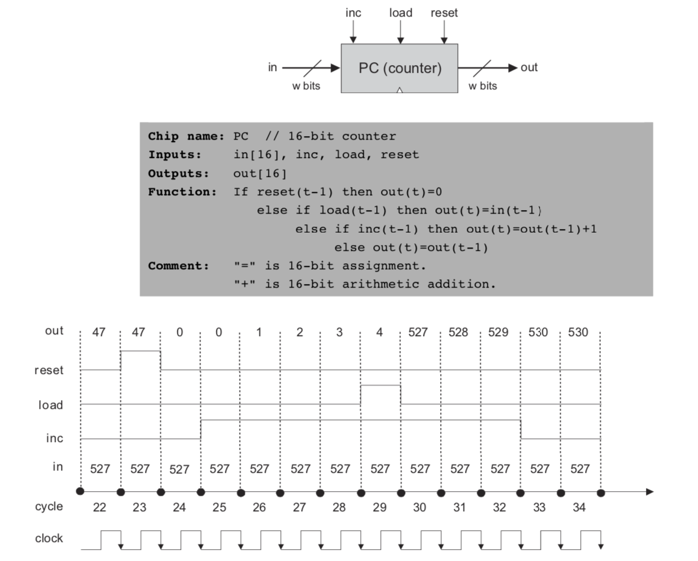

# 第三章：时序逻辑

## 0.0 目的

构建并仿真 projects/03 目录里面的所有芯片

## 0.1 提示

可以看到在时序芯片的逻辑实现上，存在将输出作为输入（即反馈环）的情况，这在组合芯片的逻辑里是无法实现的，会导致数字竞争的情况出现，但是在时序条件下是可以实现的。因为会有时钟逻辑延迟，比如在DFF芯片里，$out(t)$ 是关于 $in(t-1)$ 的函数而不是 $in(t)$ 的函数。

## 一、1比特位寄存器（Bit）

同样，我们在内部利用反馈环循环调用DFF芯片的输出，代码如下：

```verilog
CHIP Bit {
    IN in, load;
    OUT out;

    PARTS:
    // Put your code here:
    Mux(a=dffout, b=in, sel=load, out=muxout);
    DFF(in=muxout, out=out, out=dffout);
}
```

## 二、寄存器（Register）

Register 就是16位的比特寄存器，因此不再赘述。

## 三、存储（RAM8）

可进行直接访问的记忆单元（RAM）是由n个w-位寄存器（Register）组成的阵列。RAM 比寄存器多了个地址（address）的输入。所以我们要先找到地址的输入位置然后就和 Register 一样的操作了。

1. 首先我们利用 DMux8way 和 address 得到八个地址亦或输出管脚，

   ```verilog
   DMux8Way(in=load, sel=address, a=a, b=b, c=c, d=d, e=e, f=f, g=g, h=h);
   ```
2. 再在每个地址实现 Register 得到八个输出

   ```verilog
   Register(in=in, load=a, out=regA);
   Register(in=in, load=b, out=regB);
   Register(in=in, load=c, out=regC);
   Register(in=in, load=d, out=regD);
   Register(in=in, load=e, out=regE); 
   Register(in=in, load=f, out=regF);
   Register(in=in, load=g, out=regG);
   Register(in=in, load=h, out=regH);
   ```
3. 最后通过 Mux8way16 选择我们要的输出

   ```verilog
   Mux8Way16(a=regA, b=regB, c=regC, d=regD, e=regE, f=regF, g=regG, h=regH, sel=address, out=out);
   ```

## 四、RAM64、512、4K、16K

所有这些芯片不过是RAM8的重复罢了，不再赘述，具体代码见同目录下。

## 五、计数器（Program Counter or PC）



计数器的实现一共有三个功能：

1. 重置：当 reset 信号为 1 的时候，out 被重置为0
2. 计数：当 inc 信号为 1 的时候，out 开始自动加一
3. 初始化：通过 load 改变初始值 out

写代码时我们要自下而上，先写出各个功能的输出，再通过 Mux16 和各个功能的控制位判断真正的输出是什么。注意 inc 的功能实现需要前一个时刻的 out 和 register，即利用反馈环实现。

```verilog
CHIP PC {
    IN in[16],load,inc,reset;
    OUT out[16];

    PARTS:
    // Put your code here:

    // inc 功能实现
    Inc16(in=out5,out=out1);
    Mux16(a=out5,b=out1,sel=inc,out=out2);

    // load 功能实现
    Mux16(a=out2,b=in,sel=load,out=out3);

    // reset 功能实现
    Mux16(a=out3,b=false,sel=reset,out=out4);

    // 最后整合得到最后的输出并作为 inc 下一个时刻的输入即这里的 out5
    Register(in=out4,load=true,out=out5,out=out);
}

```
