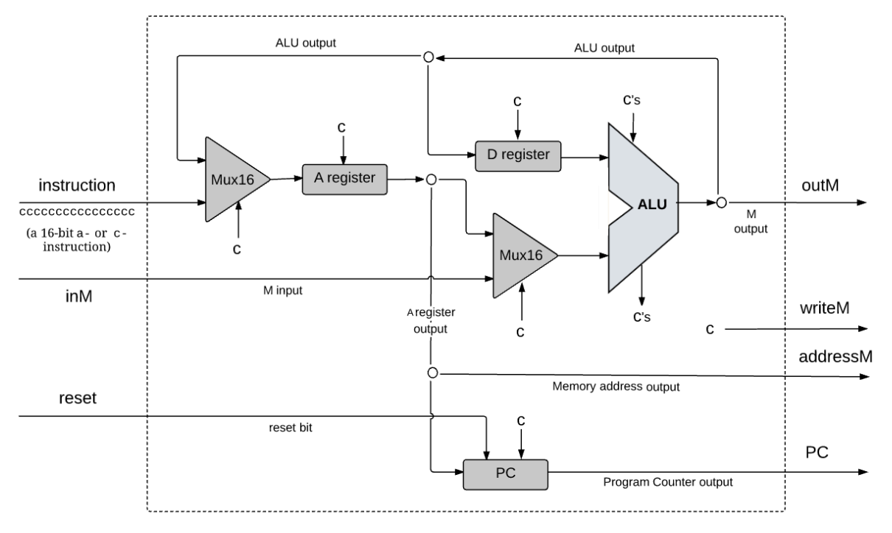
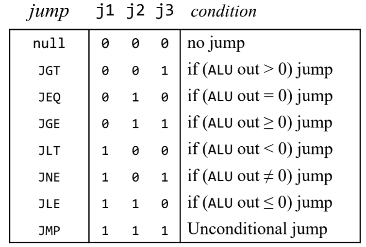

# 第五章：计算机体系架构

## 0.0 目的

构建 Hack 计算机平台，最后得到最高级的 Computer 芯片。

## 0.1 提示

Hack 平台中的大部分行为都发生在它的中央处理器中，所以我们的主要任务就是构建 CPU。相比之下，计算机平台的其他部分的实现就很简单了。代码借鉴了这位老哥的：

https://github.com/VanTamNguyen/Nand2Tetris/commits?author=VanTamNguyen

## 一、中央处理器（CPU）



### 1.1

首先，我们要先判断输入 `instruction` 是 A-指令还是 C-指令，判断依据是16位数字的首位数字，如果是 `0`，就是 A-指令，反之为 C-指令：

```
And(a=instruction[15], b=true, out=instructionC);
Not(in=instructionC, out=instructionA);
```

### 1.2

下面一步是第一个 `Mux16` ，当输入 `instruction` 是 A-指令 时，我们希望 `Mux16`的输出是 `instruction` ，当输入是 C-指令时，我们希望输出是 `ALU_out`，这里的 `sel` 可以选用上面定义的 `instructionA`：

```
Mux16(a=ALUout, b=instruction, sel=instructionA, out=inA);
```

### 1.3

从这一步开始最核心的 `ALU` 板块，首先我们要知道这是建立在指令是 C-指令 的前提下，我们先看看C-指令 不同位对应的什么：

```
15 14 13 12 11 10 09 08 07 06 05 04 03 02 01 00
1  1  1  a  c1 c2 c3 c4 c5 c6 d1 d2 d3 j1 j2 j3
```

从  `instruction[11] `到  `instruction[06]` 对应的是 `ALU`里的 `zx nx zy ny f no`

从  `instruction[05] `到  `instruction[03]` 分别对应的是 `A register` 里的 `load`（称为`loadA`) ，`D register` 里的 `load`（称为`loadD`)，`writeM` 前的输入 `c`。

我们先求出 loadA 和 loadD:

```
And(a=instructionC, b=instruction[5], out=instCAndDestA);
Or(a=instructionA, b=instCAndDestA, out=loadA);
And(a=instructionC, b=instruction[4], out=loadD);
```

### 1.4

因此我们可以构建 `A register` 和 `D register`

```
ARegister(in=inA, load=loadA, out=outA, out[0..14]=addressM);
DRegister(in=inD, load=loadD, out=outD);
```

### 1.5

下面这一步构建第二个` Mux16`，这一步完成之后 `ALU` 所有的输入都满足了

```
Mux16(a=outA, b=inM, sel=instruction[12], out=aluInY);
```

### 1.6

`ALU` 的代码集成了上面的元素就可以得到：

```
ALU(x=outD, y=aluInY, zx=instruction[11], nx=instruction[10], zy=instruction[9], ny=instruction[8],f=instruction[7], no=instruction[6],out=ALUout, out=outM, zr=zrALU, ng=ngALU);
```

### 1.7

接下来我们构建 `PC` 模块，首先我们需要先得到 `PC` 的输入 `load` （设为 `loadPC`），我们先看看 `PC` 的逻辑：

```
if (reset == 1) PC = 0 
else
    // 当前指令
    load = f(jump bits, ALU control outputs)
    if (load == 1) PC = A
    else PC++
```

可以看到 `load` 是比较 `instruction` 的后三位：`instruction[02,01,00]` 和 `ALU` 的输出得到的。

下面我们要实现的就是伪代码里的 `f(jump bits, ALU control outputs)`，这个函数的逻辑在第四章里讲过，就是实现下面这张表：



```
Not(in=zrALU, out=notZr);
Not(in=ngALU, out=notNg);
And(a=notZr, b=notNg, out=psALU); // 得到ALU的输出是不是正的

And(a=instruction[1], b=zrALU, out=zrMatched);
And(a=instruction[2], b=ngALU, out=ngMatched);
And(a=instruction[0], b=psALU, out=psMatched);
  
And(a=instructionC, b=zrMatched, out=jumpZR);
And(a=instructionC, b=ngMatched, out=jumpNG);
And(a=instructionC, b=psMatched, out=jumpPS);
Or(a=jumpZR, b=jumpNG, out=jumpZROrNG);
Or(a=jumpZROrNG, b=jumpPS, out=loadPC);
```

### 1.8

`loadPC` 完成之后，我们就可以得到PC的代码：

```
PC(in=outA, load=loadPC, inc=true, reset=reset, out[0..14]=pc);
```

### 1.9

最后一步得到 `writeM`

```
And(a=instructionC, b=instruction[3], out=writeM);
```

## 二、内存（Memory）

恭喜你！你已经完成了本章最难的部分，下面是构建内存板块。在构建内存芯片的时候，我们要用到内置的三种芯片：`ROM32K`，`Screen`和 Keyboard 。首先我们先使用 `Mux16` 分配 `load` 以确定地址在 `ROM` 还是 `Screen`。然后通过三个内置芯片得到各自的输出，再通过 `Dmux4Way16` 确定我们的输出是 `ROM`，`Screen` 还是 `Keyboard`的输出。

## 三、计算机（Computer）

Computer 的芯片就更简单了，只要把 CPU，Memory 和 ROM32 放在一起就行了。
